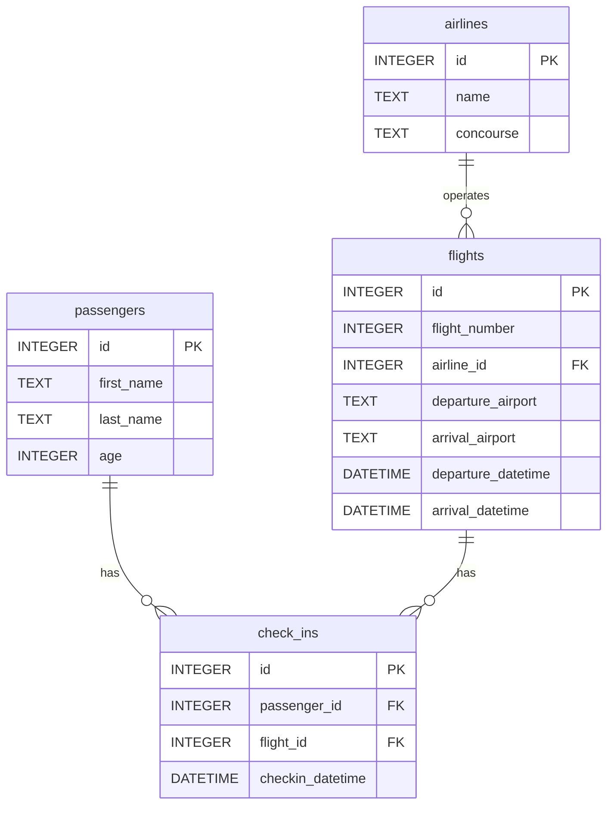

```mermaid
erDiagram
    passengers {
        INTEGER id PK
        TEXT first_name
        TEXT last_name
        INTEGER age
    }
    airlines {
        INTEGER id PK
        TEXT name
        TEXT concourse
    }
    flights {
        INTEGER id PK
        INTEGER flight_number
        INTEGER airline_id FK
        TEXT departure_airport
        TEXT arrival_airport
        DATETIME departure_datetime
        DATETIME arrival_datetime
    }
    check_ins {
        INTEGER id PK
        INTEGER passenger_id FK
        INTEGER flight_id FK
        DATETIME checkin_datetime
    }

    passengers ||--o{ check_ins : has
    airlines ||--o{ flights : operates
    flights ||--o{ check_ins : has
```