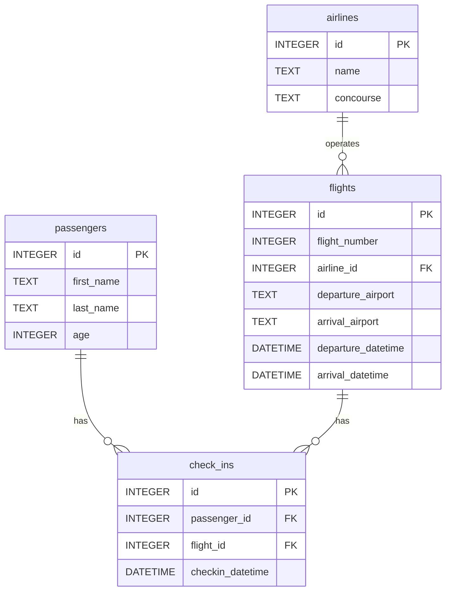

# 🛫 ATL - Base de Données de l'Aéroport Hartsfield-Jackson
J'ai toujours voulu visiter les USA !

Bref... Let's go !

Parlons de l'un des aéroports les plus fréquentés au monde en termes de passagers et de mouvements d'aéronefs; il s'agit de **l'Aéroport Hartsfield-Jackson**, situé à Atlanta, en Géorgie, aux États-Unis.

Ce projet SQL vise principalement à **Concevoir la base de données de l’aéroport international Hartsfield-Jackson d’Atlanta (ATL)**.

---
## Objectif
**Créer une base de données relationnelle** permettant de suivre :
- Les **passagers**
- Les **compagnies aériennes**
- Les **vols**
- Les **enregistrements** (check-ins)

Le tout en respectant les contraintes d’intégrité, en évitant les doublons, et en assurant des jointures correctes via des identifiants uniques.

---
## 📊 Schéma Entité-Relation (ER Diagram) : Diagramme Mermaid🧜‍♀️

Voici un peu les relations qu'il y a : 

- ```passengers ||--o{ check_ins : has``` : Un passager peut avoir **zéro ou plusieurs** enregistrements. Chaque enregistrement appartient à **un seul** passager. Autrement dit, Essi BALLOGOU (moi-mème🫡) peut s'enregistrer à plusieurs vols, mais chaque enregistrement est lié à un seul passager.

- ```airlines ||--o{ flights : operates```: Une compagnie aérienne opère **zéro ou plusieurs** vols. Chaque vol est opéré par **une seule** compagnie.

- ```flights ||--o{ check_ins : has``` : Un vol peut avoir **zéro ou plusieurs** enregistrements. Chaque enregistrement est lié à **un seul vol**. Autrement dit, le vol Delta 300 peut accueillir plein de passagers, mais un check-in correspond toujours à un seul vol.

Schématisons tout ça pour avoir un overview des relations qui existent entre les entités : 

### Diagramme au format Mermaid🧜‍♀️ :

---
## Structure du projet
- schema.sql # Code SQL principal (création, insertion, nettoyage) où on va :
   - Créer les tables finales avec clés primaires et étrangères
   - Importer les données depuis les fichiers CSV via des tables temporaires
   - Effectuer les jointures nécessaires pour lier vols, compagnies et passagers
- Diagramme.md # Diagramme ER (au format Mermaid)
---
Source: https://cs50.harvard.edu/sql/2023/psets/2/atl/

Documentation SQLite: https://www.sqlite.org/index.html (ps: ça m'a beaucoup aidé)

